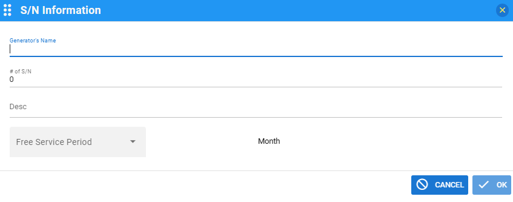

# LooksPlusIO

IoT Device Development SDK for atCloud365.com

## Concept

By generalizing IoT devices, all devices are managed as a single object.<br>
The Object internal methods(funections) are all same but data is different.

## Tested B/D (Modules)

### OLIMAX-ESP32-GATEWAY B/D
### ESP8266( NodeMCU 1.0 (ESP-12E Module)

- 

### ESP8266


```text
https://arduino.esp8266.com/stable/package_esp8266com_index.json
https://arduino.esp8266.com/stable/package_esp8266com_index.json,https://espressif.github.io/arduino-esp32/package_esp32_index.json
```

## External Libs

- List of libs ( external libs)
  
  ```text
  ArduinoJson
  DHTesp
  NTPClient
  WebSockets_Generic
  ```

## Live Demo : https://atcloud365.com

## Steps for Using SDKs

- Access https://atcloud365.com/mfg
- Signup and Login
- Define Your Equipment
- Generate SN for your Device
- Details with Pictures





